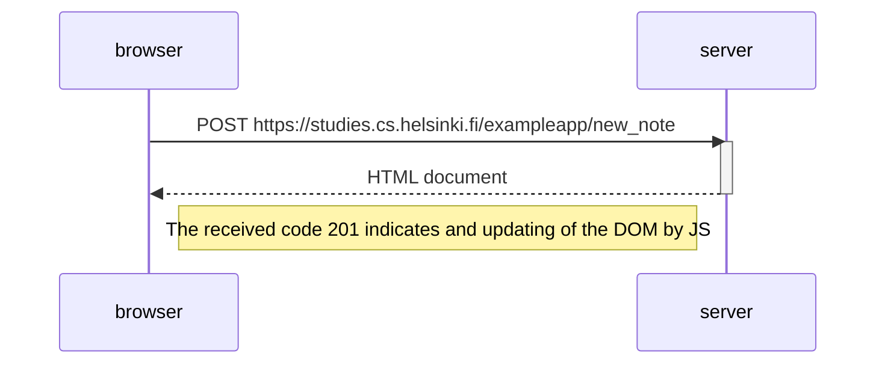

Excercise 6:

Single Page Application form handling

```mermaid
sequenceDiagram
    participant browser
    participant server

    browser->>server: POST https://studies.cs.helsinki.fi/exampleapp/new_note
    activate server
    server-->>browser: HTML document
    deactivate server

    Note right of browser: The received code 201 indicates and updating of the DOM by JS
```